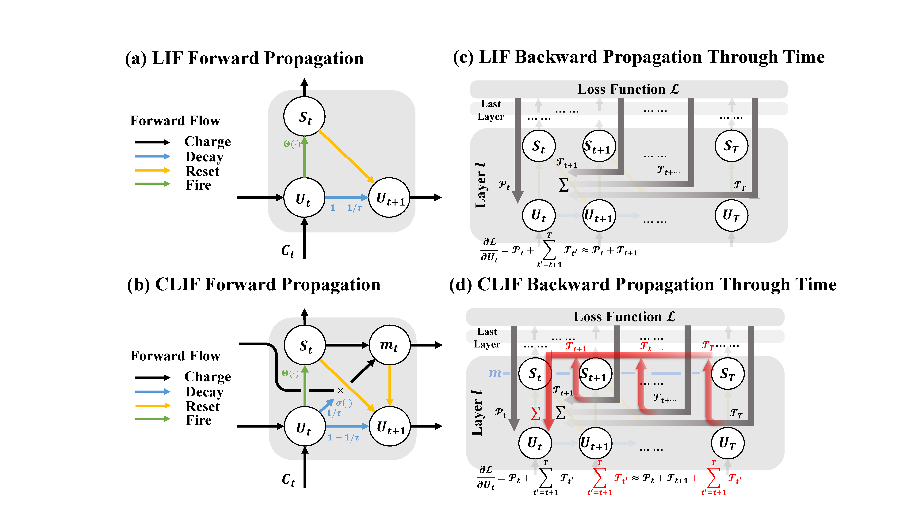

# CLIF: Complementary Leaky Integrate-and-Fire Neuron for Spiking Neural Networks (**[ICML 2024](https://openreview.net/pdf?id=yY6N89IlHa)**)

(This repository is updating......)

Commonly used LIF neurons suffer from the vanishing gradient problem in the temporal dimension. This work propose the Complementary Leaky Integrate-and-Fire (CLIF) Neuron without (hyper)parameters. CLIF creates extra paths to facilitate the backpropagation in computing temporal gradient while keeping binary output.

It is feasible to train a model using CLIF and subsequently deploy it or inference with LIF. We take pre-trained models of CLIF and LIF (Resnet18 with T=6) to perform inference on the CIFAR10 and CIFAR100 tasks. To compensate for CLIF’s enhanced reset process, we employ a hard reset with a bias as a hyperparameter. As can be seen in Table, this approach leads to an inference accuracy that surpasses that of a model directly trained with LIF.

_Table. Directly convert the pre-trained CLIF/LIF model to an LIF neuron for inference._
|                          |            |            |        |        |        |        |         |
|--------------------------|------------|------------|--------|--------|--------|--------|---------|
| **CIFAR10**              | **Soft Reset** | **Hard Reset** |        |        |        |        |         |
| Reset Value              | None       | 0          | -0.02  | -0.04  | -0.06  | -0.08  | -0.1    |
| CLIF pretrained (**95.41%**) | 92.95%     | 93.41%     | 94.18% | 94.54% | **95.08%** | 94.84% | 94.72%  |
| LIF pretrained (**94.51%**)  | 94.51%     | 84.05%     | 76.68% | 66.08% | 52.16% | 38.00% | 27.04%  |
|                          |            |            |        |        |        |        |         |
| **CIFAR100**                 | **Soft Reset** | **Hard Reset** |        |        |        |        |         |
| Reset Value              | None       | 0          | -0.02  | -0.04  | -0.06  | -0.08  | -0.1    |
| CLIF pretrained (**78.36%**) | 68.72%     | 73.04%     | 74.64% | 76.63% | 76.55% | **77.00%** | 76.54%  |
| LIF pretrained (**76.23%**)  | 76.23%     | 47.74%     | 37.04% | 27.56% | 19.83% | 13.22% | 8.77%   |
|                          |            |            |        |        |        |        |         |

## Dependencies
- Python 3
- PyTorch, torchvision
- spikingjelly 0.0.0.0.12
- Python packages: `pip install tqdm progress torchtoolbox thop`

## Training
We use single GTX4090 GPU for running all the experiments. Multi-GPU training is not supported in the current codes.

### Setup
CIFAR-10, CIFAR-100, Tiny-Imagenet, DVS-CIFAR10, and DVS-Gesture:

    # CIFAR-10
	python train_BPTT.py -data_dir ./data_dir -dataset cifar10 -model spiking_resnet18 -T_max 200 -epochs 200 -weight_decay 5e-5 -neuron CLIF
    
    # CIFAR-100
    python train_BPTT.py -data_dir ./data_dir -dataset cifar100 -model spiking_resnet18 -T_max 200 -epochs 200 -neuron CLIF
    
    # Tiny-Imagenet
    python train_BPTT.py -data_dir ./data_dir -dataset tiny_imagenet -model spiking_vgg13_bn -neuron CLIF
       
    # DVS-CIFAR10
	python train_BPTT.py -data_dir ./data_dir -dataset DVSCIFAR10 -T 10 -drop_rate 0.3 -model spiking_vgg11_bn -lr=0.05  -mse_n_reg -neuron CLIF
	
	# DVS-Gesture
    python train_BPTT.py -data_dir ./data_dir -dataset dvsgesture -model spiking_vgg11_bn -T 20 -b 16 -drop_rate 0.4  -neuron CLIF

If you change the neuron, you can directly switch to ``LIF`` or ``PLIF`` by modifying the hyperparameters after ``-neuron``.

For example to setup LIF neuron for CIFAR-10 task:

    # LIF neuron for CIFAR-10
	python train_BPTT.py -data_dir ./data_dir -dataset cifar10 -model spiking_resnet18 -amp -T_max 200 -epochs 200 -weight_decay 5e-5 -neuron LIF
    

## Inference
The inference setup could refer file: ``run_inference_script``
